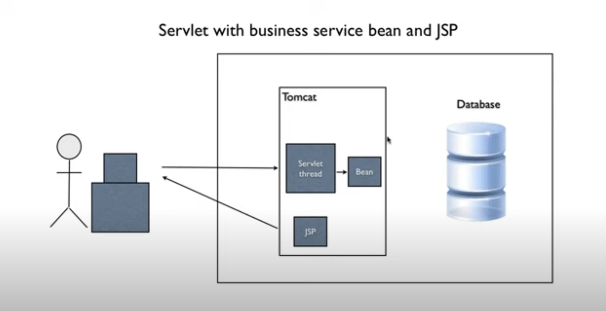
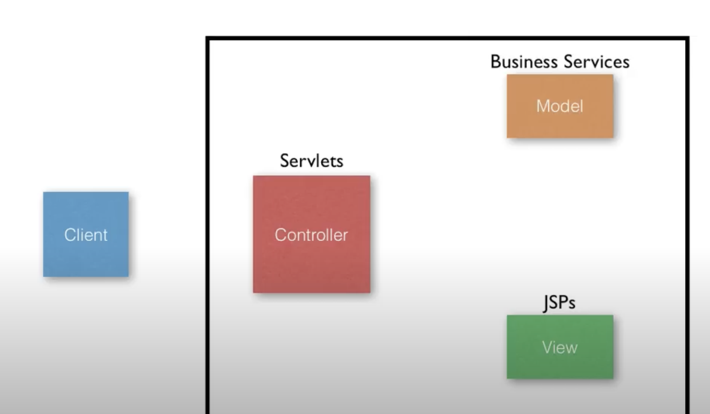
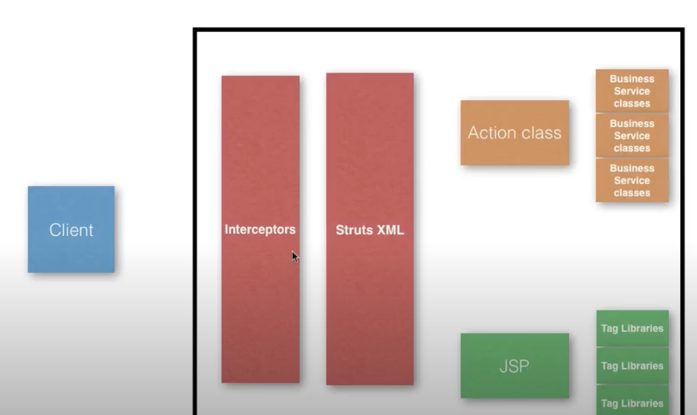
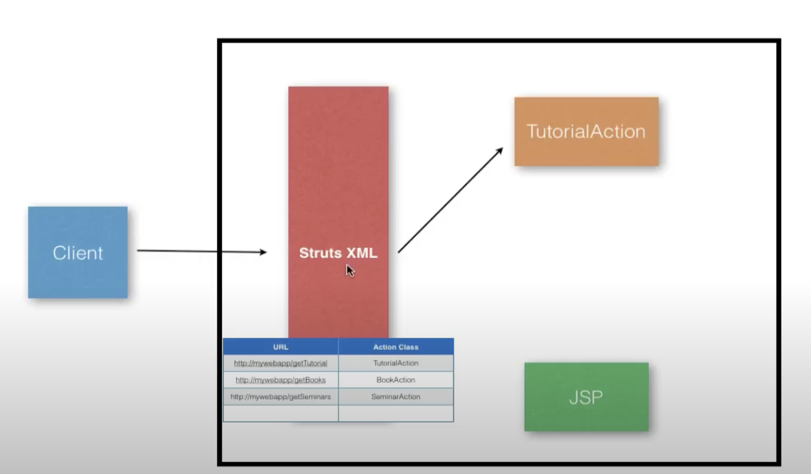

# Struts 2

### Introduction to MVC

* MVC - Model, View, Controller

### Why MVC?
* Controller is separated from model
* View is separated from model
* View is separated from Controller

### MVC Frameworks
* Different MVC frameworks have different implementations of these concepts
* They provide prebuilt classes
* They are extensible
* Popular Java Web MVC Frameworks: Struts, Struts 2, Spring MVC, Play, JSF, Wicket and many more.

### Framework Vs Pattern
* Pattern is the way you can architect your application
* Framework provides foundation classes and libraries
* Gets us started quickly
* Leverages industry best practices

### MVC Framework 



### About Struts 2
* It is an MVC Framework
* Version 2
* Gives us prebuilt classes for MVC that we can use / extend

### Setting up
* Download struts 2:  https://struts.apache.org/index.html
* Download and install ECLIPSE IDE: https://www.eclipse.org/downloads/
* While installing Eclipse IDE, select Eclipse IDE for Enterprise Java and Web Developers option
* To open the eclipse workspace directory from mac, click "shift + command + h"
* Inside the eclipse workspace, paste apache tomcat server files

### Creating a new struts project
* From "New", select "other", select "Dynamic Web Project" from "Web" and click next.
* Write project name, set project location, set target runtime (Example Apache Tomcat v7.0) if set previously, otherwise, click new runtime, select any apache tomcat vx.x from Apache, Browse Tomcat installation directory if already installed otherwise Download and install to a location and keep other settings as default and click next and next
* Update content directory to web if needed and check generate web.xml deployment descriptor and click on Finish

### Adding User libraries
* Right click on project and click properties
* Click on "Java Build Path" and select "Libraries" tab and select "Modulepath" and click Add Library
* Select "User Library" and click on next
* Click "User Libraries" and new click "new" and write a User library name and click ok
* Select "Strust2" and click on "Add External JARs"
* Select all the JARs from the struts downloaded folders lib directory
* Click on apply and finish and close all the modals
* Right click on the Project and select Deployment Assembly
* Click "Add" and select "Java Build Path Entries" and Select "Struts2" which was previously created list of external JARs of User Libraries
* Click Apply and close.

### Main Components of the struts 2 MVC Framework
* Action Class
* JSP
* Struts 2 XML

### Struts 2 XML
* Controls the execution flow of requests
* Input: URL
* Needs to map to:
    * Action Classes
    * JSPs
* URL to Action Class
For Examples:
    URL: http://mywebapp/getTutorial
    Action Class: TutorialAction

    URL: http://mywebapp/getBooks
    Action Class: BookAction

    URL: http://mywebapp/getSeminars
    Action Class: SeminarAction



### Which Method?
* Default method of Action class is execute()
* Other methods can be configured

### Which JSP?
* JSP displayed depends on the result of the method execution
* Same action class may need to show different JSPs
* Action class result 'code' to JSP: 
    * Code: Success, JSP: success.jsp
    * Code: Failure, JSP: error.jsp
    * Code: NoSession, JSP: login.jsp

### Namespaces
In the struts2 framework, a namespace is a way to organize actions into logical modules. Each namespace has its own identifying prefix and can have its own "help" or "menu" action. 
```
<package name="default" namespace="/tutorials" extends="struts-default">
    <action name="getTutorial" class="com.nextpage.Home">
        <result name="success">/success.jsp</result>
        <result name="failure">/failure.jsp</result>
    </action>
</package>
```
Struts2 URL construction
```
http://localhost:8080/Struts2Starter/tutorials/getTutorial.action

http://<server>:<port>/<webapp>/<namespace>/<action-name>.action
```